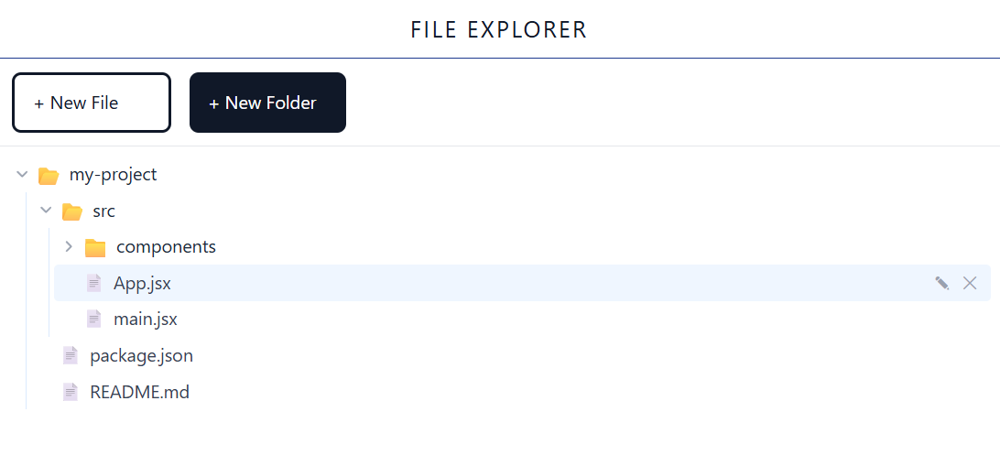

# File Explorer

A React-based file explorer that allows users to create, delete, and rename files and folders in a tree-like structure.

## Features

- **Create Files & Folders**: Add new files or folders to the tree.
- **Delete Files & Folders**: Remove items from the tree.
- **Rename Files & Folders**: Edit the names of existing items.
- **Expand & Collapse**: Toggle the visibility of folder contents.
- **Visual Feedback**: Icons and styling to distinguish between files and folders.


## Getting Started

1. **Clone the repository**.
```bash

git clone https://github.com/Nancy-30/FileExplorer.git

```

2. **Install dependencies**:
```bash
npm install
```

3. **Run the development server**:
```bash
npm run dev
```

The application will be available at `http://localhost:5173`.

## UI Image



## Usage

- Click the **expand/collapse** icon (▶/▼) next to a folder to show/hide its contents.
- Click the **+f** button to add a new file to the current folder.
- Click the **+d** button to add a new folder to the current folder.
- Click the **delete** button (✕) to remove an item.
- Use **Enter** to confirm changes and **Escape** to cancel.

